# Uptime Monitor

Monitor your infrastructure with ease. Follow these steps to create a new monitor in **Checkmate.so**:

```mermaid
%%{init: {'theme': 'base', 'themeVariables': { 'primaryColor': '#146eee', 'edgeLabelBackground':'#0e0e11', 'tertiaryColor': '#0e0e11', 'primaryTextColor': '#ffffff', 'secondaryTextColor': '#ffffff'}}}%%
graph LR
    A[Start: Create a New Monitor] --> B[Enter General Settings]
    B --> C[Choose Checks to Perform]
    C --> D[Configure Incident Notifications]
    D --> E[Set Advanced Options]
    E --> F[Review and Create Monitor]
    F --> G[Monitor Active] --> H[Receive Notifications on Incidents]
```

---

## General Settings

- **URL to Monitor:**  
  Provide the complete URL of the website or service you want to monitor.  
- **Display Name (Optional):**  
  Assign a custom name for easier identification in your dashboard.

---

## Checks to Perform

Select the type of checks you want to configure:  
- **Website Monitoring:**  
  Uses HTTP(s) protocols to monitor your website or API endpoint.  
  - Options: HTTPS or HTTP.
- **Ping Monitoring:**  
  Confirms the server's availability using ping responses.  
- **Docker Monitoring (Experimental):**  
  Monitors whether a Docker container is running.  
  - Note: Ensure your Docker daemon is exposed.

---

## Incident Notifications

Stay informed when incidents occur:  
- **Email Notifications:** Receive alerts via email.  
- **Upcoming Features:** SMS and push notifications are on the way.  

---

## Advanced Settings

- **Check Frequency:**  
  Set the frequency of checks. The default is 1 minute, but you can adjust this based on your requirements.  

After completing all configurations, click the **Create Monitor** button at the bottom-right to activate your monitor.  

---