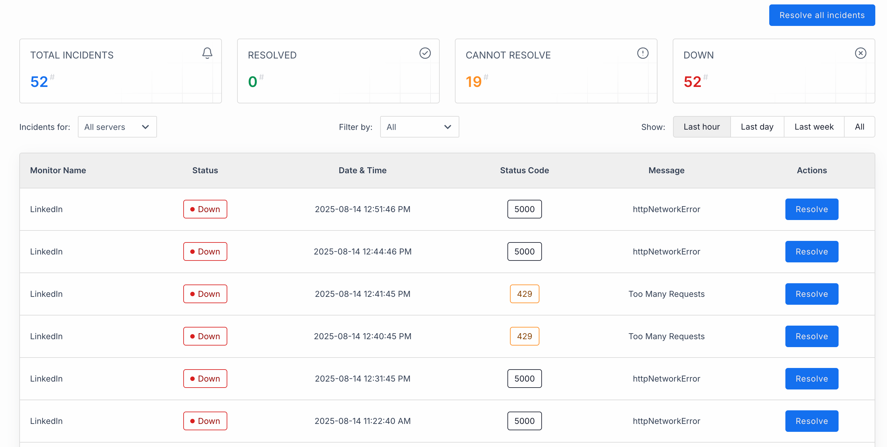

# Incidents

This page provides a comprehensive overview of all incidents across the servers you monitor. The incidents are displayed in a detailed table format, allowing you to quickly assess the status and details of each incident.

## Incidents overview

<figure><figcaption></figcaption></figure>

Incidents page includes a table where Monitor name, Status (down or cannot resolve), date and time of the incident, status code and corresponding message is shown.

By default, the page shows all incidents from all servers. There is also a dropdown button above the table where you can select a server name.

The incidents table includes the following columns:

* **Monitor Name:** The name of the monitor that detected the incident.
* **Status:** The current status of the incident (e.g., Active, Resolved).
* **Date & Time:** The timestamp when the incident was first detected.
* **Status Code:** The HTTP status code returned during the incident.
* **Message:** Additional information or error message related to the incident.

## Resolving an incident

The “Resolve all incidents” button at the top will mark every incident in your current view as resolved in one go. This clears them from the active list and updates your resolved-count.&#x20;

Each little “Resolve” button on the right does the same thing, but just for that single incident: acknowledging that you’ve handled it and dropping it off the active incidents table.

<figure><figcaption></figcaption></figure>

***
