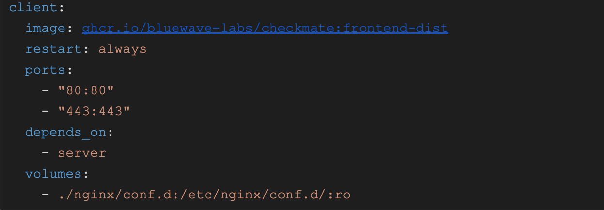

# Installing Checkmate

Installing Checkmate is a fairly straightforward process on a Linux machine. There are many installation options though, which may be overwhelming. Here is a breakdown of all the options:&#x20;

1. If you'd like to deploy on a Linux server, we suggest you go with **Combined FE/BE Docker option.** This keeps backend and frontend on one Docker, and Redis and MongoDB on two other Docker services.
2. If you want to deploy on a Linux server, but want to keep frontend and backend on two separate Docker images, then go with **Separate FE/BE option**. Note that this installation method may not be as straightforward as the first oe.
3. (For developers), there is also a 3rd option for developers who want to work on the application, e.g extend and test it.

## Option 1: Combined FE/BE Docker installation (easy method) <a href="#user-quickstart" id="user-quickstart"></a>

In this installation, the React front-end is served from the API server. There is no Client image as it is not required. Note that this is still a React SPA and is served to your browser where it runs.

Requests to the API server are made from your browser. If that is on a different machine than your API server, then you must configure the API URL appropriately.

To get started:

* Download the [Docker compose file](https://raw.githubusercontent.com/bluewave-labs/Checkmate/develop/docker/dist-mono/docker-compose.yaml).
* Run `docker compose up` to start the application.

Your application will spin up at `http://localhost:52345`

Configuration remains the same as the regular server, with two additional frontend ENV vars:

* **UPTIME\_APP\_API\_BASE\_URL:** http://localhost:52345/api/v1
* **UPTIME\_APP\_CLIENT\_HOST:** http://localhost


NOTE:\
\
If you’d like to host your Checkmate instance somewhere other than the machine your browser is running on, you will need to update these vars. As an example, if you were hosting at `143.110.231.94`, use the following variables:\


<pre><code><strong>UPTIME_APP_API_BASE_URL=http://143.110.231.94:52345/api/v1
</strong><strong>UPTIME_APP_CLIENT_HOST=http://143.110.231.94
</strong><strong>CLIENT_HOST=http://143.110.231.94
</strong></code></pre>

Where,

* UPTIME\_APP\_API\_BASE\_URL points the client to the server
* UPTIME\_APP\_CLIENT\_HOST is used for building some links that point to the client
* CLIENT\_HOST is the origin that the API server will approve requests from


If you are upgrading from a previous deployment:\


* As long as you mount the same directories to the MongoDB image you'll retain your data.
* The Mongo part of the application remains unchanged.
* You can always back up your data directory as well before migration.

## Option 2: Separate FE/BE Docker installation <a href="#user-quickstart" id="user-quickstart"></a>

In this installation, the React front-end is served by an Nginx Docker image (named Client) and is independent of the API server.

Note that if you want to configure Nginx, you will have to mount a volume to the Client image to override the default config:

<figure><figcaption></figcaption></figure>

### 2.1 Running on a local machine <a href="#user-quickstart" id="user-quickstart"></a>

1. Download our [Docker compose file](https://raw.githubusercontent.com/bluewave-labs/Checkmate/refs/heads/master/docker/dist/docker-compose.yaml)
2. Run `docker compose up` to start the application
3. Now the application is running at `http://localhost`

**Optional config:**

* If you want to monitor Docker containers, uncomment this line in `docker-compose.yaml`:

```
  # volumes:
  # - /var/run/docker.sock:/var/run/docker.sock:ro
```

This gives the app access to your docker daemon via unix socket, please be aware of what you are doing.

### 2.2 Running on a remote server <a href="#user-quickstart" id="user-quickstart"></a>

1. Download our [Docker compose file](https://raw.githubusercontent.com/bluewave-labs/Checkmate/refs/heads/master/docker/dist/docker-compose.yaml)
2. Edit the `UPTIME_APP_API_BASE_URL` variable in the docker-compose file to point to your remote server.
3. Run `docker compose up` to start the application
4. Now the application is running at `http://<remote_server_ip>`

**Optional config:**

* If you want to monitor Docker containers, uncomment this line in `docker-compose.yaml`:

```
  # volumes:
  # - /var/run/docker.sock:/var/run/docker.sock:ro
```

This gives the app access to your Docker daemon via unix socket, please be aware of what you are doing.

***

## Deploying on Windows <a href="#dev-quickstart" id="dev-quickstart"></a>

This is like option 2, but for Windows machines.

### Step 1: Fork and clone the repository

1. **Fork the repository:** Go to the Checkmate GitHub repository and fork it to your account.
2.  **Clone the repository:** Open your terminal or command prompt and run:

    ```
    git clone https://github.com/your-username/checkmate.git
    cd checkmate
    ```

### Step 2: Set up the backend (server)

1. **Navigate to the server directory:**
2. `cd server`
3. **Install dependencies:**
4. `npm install`
5. **Create a `.env` File:** Add a `.env` file in the `server` directory to hold your server secrets.

### Step 3: Build and Run MongoDB and Redis Docker Images

1. **Navigate to the main directory:**
2. `cd ..`
3.  **Build Docker Images:**

    ```
    docker build -f ./docker/dev/mongoDB.Dockerfile -t uptime_database_mongo .
    docker build -f ./docker/dev/redis.Dockerfile -t uptime_redis .
    ```
4. **Navigate to the docker/dev directory:**
5. `cd server/docker/dev`
6.  **Run Docker containers:**

    ```
    docker run -d -p 6379:6379 -v $PWD/redis/data:/data --name uptime_redis uptime_redis
    docker run -d -p 27017:27017 -v $PWD/mongo/data:/data/db --name uptime_database_mongo uptime_database_mongo
    ```

### Step 4: Start the backend server

1. **Navigate to the server directory:**
2. `cd into server.`
3. **Run the development server:**
4. `npm run dev`
5. Your backend should now be up and running.

### Step 5: Set up the frontend (client)

1. **Navigate to the client directory:**
2. `cd client`
3. **Install dependencies:**
4. `npm install`
5. **Create a `.env` File:** Add a `.env` file in the `client` directory to hold your client secrets.
6. **Run the client (a.k.a frontend):**
7. `npm run dev`
8. Your frontend should now be up and running.

***

## Deploying on ARM machines <a href="#dev-quickstart" id="dev-quickstart"></a>

If you would like to install Checkmate on Raspberry PI 4, Raspberry PI 5 or MacOS, [use this link](https://github.com/bluewave-labs/Checkmate/blob/develop/docker%2Fdist-arm%2Fdocker-compose.yaml) to download the Docker compose file. Then run the usual `docker compose up` command to start instances.

Your application will spin up at `http://localhost:52345`&#x20;

Configuration environment variables is the same as what you'd use in Option 1 section above.

## Developer installation (Linux and MacOS) <a href="#dev-quickstart" id="dev-quickstart"></a>

When you’re working on the app locally, it’s painful to rebuild and reload Docker images every time you tweak the client or server. Instead, run those services directly on your host machine—this gives you instant feedback and lets you use hot-reload without waiting for image builds.

At the same time, we still include Redis and MongoDB as Docker containers. Those services rarely change, so keeping them in containers simplifies setup and avoids cluttering your host environment.


Make sure you change the directory to the specified directories, as paths in commands are relative.


### Cloning and initial setup

This application consists of a frontend (client) and a backend (server) in a single repository. Start by cloning the [repo](https://github.com/bluewave-labs/checkmate), as it contains everything you need, except the [Capture agent](https://github.com/bluewave-labs/capture) if you plan to use the Infrastructure Monitoring feature.

### Setting up Docker images

This application requires a MongoDB instance and a Redis instance. If you want, you can use our Docker images. Otherwise, you can provide your instances as well.

1. From your `checkmate` directory you created above, cd into `server/docker/dev`.
2. Run `build_images.sh`
3. Run `docker run -d -p 6379:6379 -v $(pwd)/redis/data:/data --name uptime_redis uptime_redis`
4. Run `docker run -d -p 27017:27017 -v $(pwd)/mongo/data:/data/db --name uptime_database_mongo uptime_database_mongo`&#x20;


The default Checkmate Redis Docker image does not include authentication. If your setup requires authentication (e.g, especially if you expose the server on a public IP), you need to configure it manually.


### Server set up

The server requires some configuration to run.

1. From your `checkmate` directory, CD into the `server` directory.
2. Run `npm install`.
3. In the `server` directory, create a `.env` file to hold your configuration. This is where you'll add your environment variables.
4. Add the [required environmental variables](https://docs.checkmate.so/users-guide/quickstart#env-vars-server).
5. Start the `server` by running `npm run dev`.

### Client set up

The client also requires some configuration in order to run.

1. From your `checkmate` directory, CD into the `client` directory.
2. Run `npm install`.
3. In the `client` directory, create a `.env` file to hold your configuration. This is where you'll add your environment variables.
4. Add the [required environmental variables](https://docs.checkmate.so/users-guide/quickstart#env-vars-client).
5. Start the `client` by running `npm run dev`

### Access the application

1. The `client` is running at `localhost:5173` (unless you changed the default port).
2. The `server` is running at `localhost:52345` (unless you changed the default port).

***

### Client env vars <a href="#install-client" id="install-client"></a>

1. Change directory to the `Client` directory
2. Install all dependencies by running `npm install`
3. Add a `.env` file to the `Client` directory with the following options:

| ENV Variable Name         | Required/Optional | Type      | Description        | Accepted Values                    |
| ------------------------- | ----------------- | --------- | ------------------ | ---------------------------------- |
| VITE\_APP\_API\_BASE\_URL | Required          | `string`  | Base URL of server | {host}/api/v1                      |
| VITE\_APP\_LOG\_LEVEL     | Optional          | `string`  | Log level          | `"none"`\|`"error"` \| `"warn"` \| |
| VITE\_APP\_DEMO           | Optional          | `boolean` | Demo server or not | `true`\|`false` \|                 |

Sample ENV file:

```
VITE_APP_API_BASE_URL="http://localhost:52345/api/v1"
VITE_APP_LOG_LEVEL="debug"
```

### Server env vars <a href="#install-server" id="install-server"></a>

1. Change the directory to the `Server` directory
2. Install all dependencies by running `npm install`
3. Add a `.env` file to the `Server` directory with the following options:

#### Environment variables <a href="#env-vars-server" id="env-vars-server"></a>

Configure the server with the following environmental variables. **Note that those variables need to be set in `.env` files if you are running the local development server, or in the Docker compose file if you use docker compose.**


<table><thead><tr><th width="239">ENV Variable Name</th><th width="149">Required/Optional</th><th width="116">Type</th><th>Description</th><th>Accepted Values</th></tr></thead><tbody><tr><td>CLIENT_HOST</td><td>Required</td><td><code>string</code></td><td>Frontend Host</td><td></td></tr><tr><td>JWT_SECRET</td><td>Required</td><td><code>string</code></td><td>JWT secret</td><td></td></tr><tr><td>REFRESH_TOKEN_SECRET</td><td>Required</td><td><code>string</code></td><td>Refresh JWT secret</td><td></td></tr><tr><td>DB_TYPE</td><td>Optional</td><td><code>string</code></td><td>Specify DB to use</td><td><code>MongoDB | FakeDB</code></td></tr><tr><td>DB_CONNECTION_STRING</td><td>Required</td><td><code>string</code></td><td>Specifies URL for MongoDB Database</td><td></td></tr><tr><td>PORT</td><td>Optional</td><td><code>integer</code></td><td>Specifies Port for Server</td><td></td></tr><tr><td>LOGIN_PAGE_URL</td><td>Required</td><td><code>string</code></td><td>Login url to be used in emailing service</td><td></td></tr><tr><td>REDIS_HOST</td><td>Required</td><td><code>string</code></td><td>Host address for Redis database</td><td></td></tr><tr><td>REDIS_PORT</td><td>Required</td><td><code>integer</code></td><td>Port for Redis database</td><td></td></tr><tr><td>TOKEN_TTL</td><td>Optional</td><td><code>string</code></td><td>Time for token to live</td><td>In vercel/ms format https://github.com/vercel/ms</td></tr><tr><td>REFRESH_TOKEN_TTL</td><td>Optional</td><td><code>string</code></td><td>Time for refresh token to live</td><td></td></tr><tr><td>PAGESPEED_API_KEY</td><td><strong>Deprecated</strong></td><td></td><td>API Key for PageSpeed requests</td><td>This API key can be set up in Settings.</td></tr><tr><td>SYSTEM_EMAIL_HOST</td><td>Required</td><td><code>string</code></td><td>Host to send System Emails From</td><td></td></tr><tr><td>SYSTEM_EMAIL_PORT</td><td>Required</td><td><code>number</code></td><td>Port for System Email Host</td><td></td></tr><tr><td>SYSTEM_EMAIL_ADDRESS</td><td>Required</td><td><code>string</code></td><td>System Email Address</td><td></td></tr><tr><td>SYSTEM_EMAIL_PASSWORD</td><td>Required</td><td><code>string</code></td><td>System Email Password</td><td></td></tr></tbody></table>

Sample env file

```
CLIENT_HOST="http://localhost:5173"
JWT_SECRET="my_secret"
DB_TYPE="MongoDB"
DB_CONNECTION_STRING="mongodb://localhost:27017/uptime_db"
REDIS_HOST="127.0.0.1"
REDIS_PORT=6379
TOKEN_TTL="99d"
PAGESPEED_API_KEY=<api_key>
SYSTEM_EMAIL_HOST="smtp.gmail.com"
SYSTEM_EMAIL_PORT=465
SYSTEM_EMAIL_ADDRESS=<email_address>
SYSTEM_EMAIL_PASSWORD=<password>
REFRESH_TOKEN_SECRET="my_refresh"
REFRESH_TOKEN_TTL="99d"
```


Note that for the Pagespeed feature to work, you need a [free Google Pagespeed API key from this link.](https://developers.google.com/speed/docs/insights/v5/get-started)


***

## API documentation <a href="#api-documentation" id="api-documentation"></a>

Our API is documented in accordance with the [OpenAPI spec](https://www.openapis.org/).

You can see the documentation on your local development server at http://localhost:{port}/api-docs

You can also view the documentation on our demo server [here](https://checkmate-demo.bluewavelabs.ca/api-docs).&#x20;

***

## Error handling

Errors are returned in a standard format:

`{"success": false, "msg": "No token provided"}`

Errors are handled by error handling middleware and should be thrown with the following parameters

| Name    | Type      | Default                | Notes                                |
| ------- | --------- | ---------------------- | ------------------------------------ |
| status  | `integer` | 500                    | Standard HTTP codes                  |
| message | `string`  | "Something went wrong" | An error message                     |
| service | `string`  | "Unknown Service"      | Name of service that threw the error |

Example:

```
const myRoute = async(req, res, next) => {
  try{
    const result = myRiskyOperationHere();
  }
  catch(error){
    error.status = 404
    error.message = "Resource not found"
    error.service = service name
    next(error)
    return;
  }
}
```

Errors should not be handled at the controller level and should be left to the middleware to handle.
